# iPadで数式を書いて、MATLAB livescriptでブログ記事を書いてみよう

この記事は、MATLABアドベントカレンダー（その2）の19日目の記事として書かれています。

# はじめに

私が数式を含むブログ記事を投稿するときの手順を紹介したいと思います。あくまで私が気に入っている方法であり、他にもよい方法があると思います。参考になれば幸いです。

例えば、以下のような数式が多い記事をブログ投稿したい場合を考えます。

[https://kentapt.hatenablog.com/entry/2022/02/23/122306](https://kentapt.hatenablog.com/entry/2022/02/23/122306)

そのような場合は、ここで紹介する方法が効果的でした。

大まかな手順として、以下の流れを想定しています。

1 内容をまとめ、ブログに掲載する数式を用意する

2 記事を執筆する

3 ブログ投稿がしやすい形で記事や画像をエキスポートする（マークダウン形式）

4 記事を投稿する

ここでは以下のものが必要です。

   -  ペンシルで、すらすらメモがかけるタブレット端末（≒iPadとappleペンシル） 
   -  MATLAB 

# 手順
## 手順1 内容をまとめ、ブログに掲載する数式を用意する

はじめに、ブログに書くような数式やその流れを考える必要があります。ここではその作業が完了していることを想定します。私は、以下のアプリを利用しています。もし、iPadをお持ちの方はぜひダウンロードしてみてください。

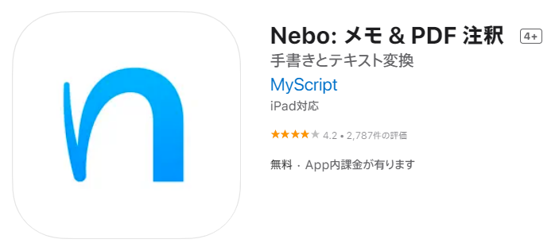

[https://apps.apple.com/jp/app/nebo-%E3%83%A1%E3%83%A2-pdf-%E6%B3%A8%E9%87%88/id1119601770](https://apps.apple.com/jp/app/nebo-%E3%83%A1%E3%83%A2-pdf-%E6%B3%A8%E9%87%88/id1119601770)

  

使い方は簡単です。数式を入れるモードがあるので、そこで、以下のようにどんどん数式を書いていきます。

ある程度数式がかけたら、右上の、「三つの点・・・」のボタンを選択して、数式に変換してください。

すると、以下の動画のように、高精度で数式を認識して、自動変換してくれます。これよりも複雑なものでも問題ありませんでした。

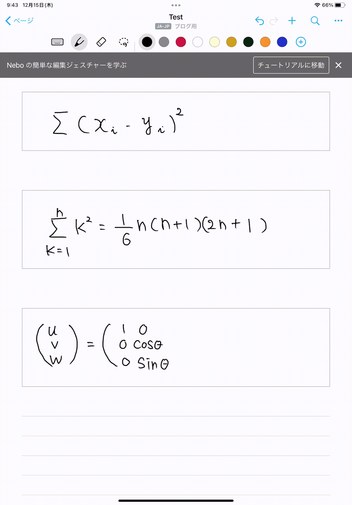

このような数式の書き込みを重ねて、記事に必要な数式が書けた場合を考えます。

次のステップとしては、このiPad上の数式をブログ投稿できる形でエキスポートします。

ここでは、割愛いたしますが、簡単なタッチ操作で、iPadで書いた数式をWordにエキスポートすることができます。（もしかしたらこのあたりで少し課金が必要かもしれません）

この作業の後、Google Driveなどを経由して、Wordファイルとしてエキスポートが可能になります。

## 手順2 記事を執筆する

次に、MATLABを開き、livescriptにて記事を書いていきます。下の「テキスト」を押すと、文字を打つことができます。ここで、どんどん原稿を書いていくとよいです。

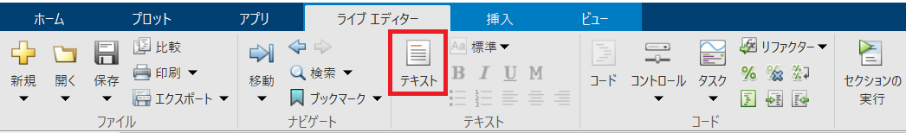

1でエキスポートした数式のコピペも簡単です。Wordにエキスポートしたファイルを開いてください。

右下の▼を押すと、行形式に変換することができます。その変換した数式をコピーしてください。

以下の動画は、Wordにて、さきほどのエキスポートしたファイルを開いたときの様子です。

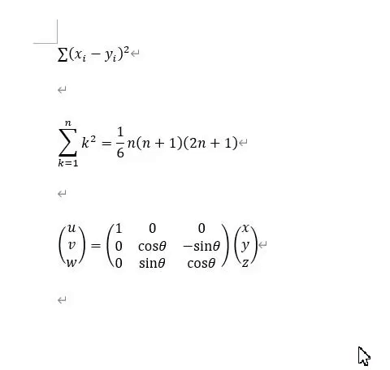

MATLABに数式をペーストするために、`挿入`タブ⇒`式`⇒`LaTeX`式を選択してください。

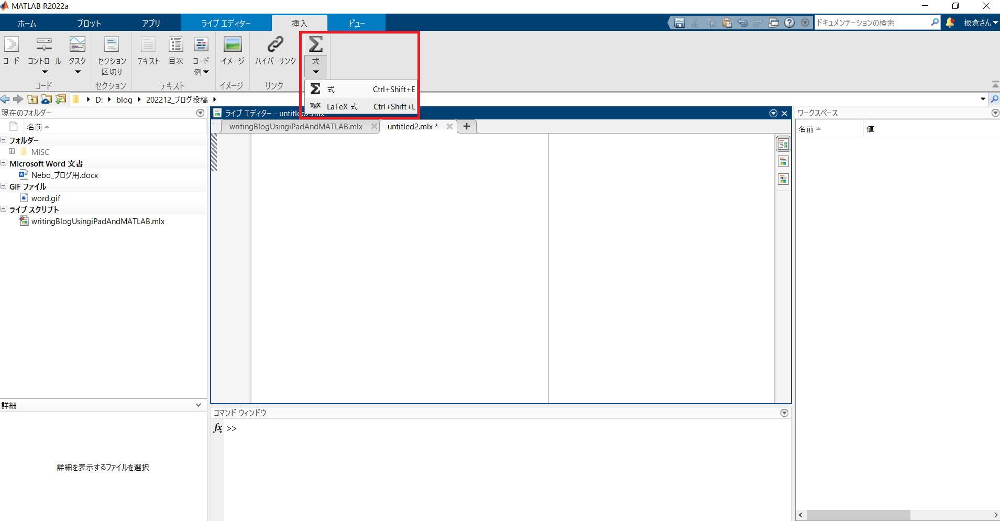

  
  

さきほどコピーした数式を張り付けると数式になります。このように数式を挿入しながら記事を書き進めます。

大変な執筆作業が終了したとします。手順3に移ります。

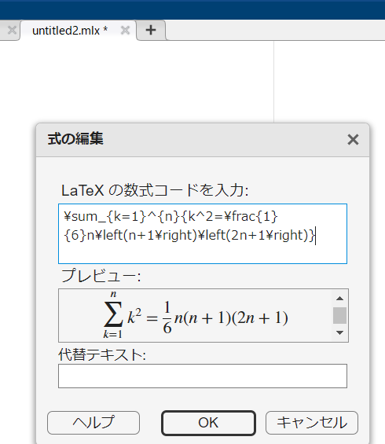

  
## 手順3 ブログ投稿がしやすい形で記事や画像をエキスポートする

私が普段利用している、はてなブログでは、マークダウン記法による記事の執筆が可能です。そのため、マークダウン形式でlive scriptをエキスポートすることができれば、ブログ投稿をスムーズに行うことができます。また、私は利用したことがないのですが、QiitaやZennといった他のサービスでも、マークダウン形式にて記事が執筆できるそうです。

  

live scriptをマークダウン形式でエキスポートするには、追加のパッケージをインストール必要があります。`ホーム`タブ=>`アドオン` をクリックしてください。

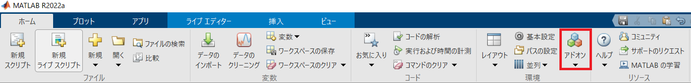

以下のLive Script To Markdown Converterを検索し、インストールしてください。ボタンを押せば簡単にインストールできます。

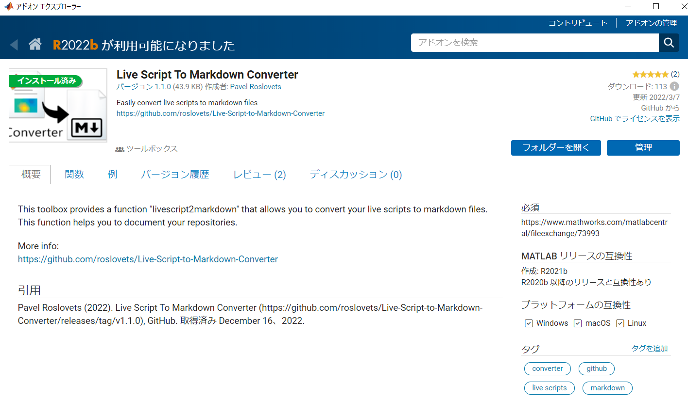

また、githubからコードをダウンロードして、コードを実行することも可能です。

https://github.com/roslovets/Live-Script-to-Markdown-Converter

  

上記のアドオンがインストールできたら、コマンドウィンドウから、live scriptをマークダウン形式のファイルに変換します。コードは以下の1行で完了です。

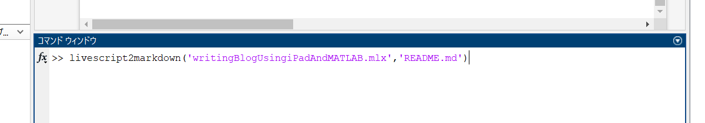

すると、以下のようにマークダウン形式の原稿（.md）と、画像ファイルが別々でエキスポートされます。

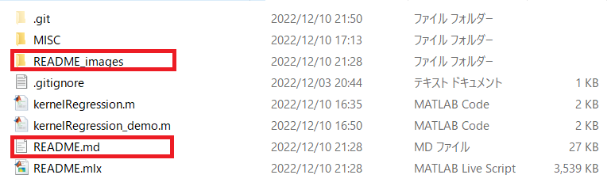

## 手順4 記事を投稿する

以下の図は、さきほどのマークダウン形式のファイルをVisual Studio Code で開いたときの様子です。ここで用いるソフトウェアは他のものでも構いません。

[https://azure.microsoft.com/ja-jp/products/visual-studio-code/](https://azure.microsoft.com/ja-jp/products/visual-studio-code/)

  

ここでの文章を再確認しながら、はてなブログに貼り付けていきます。

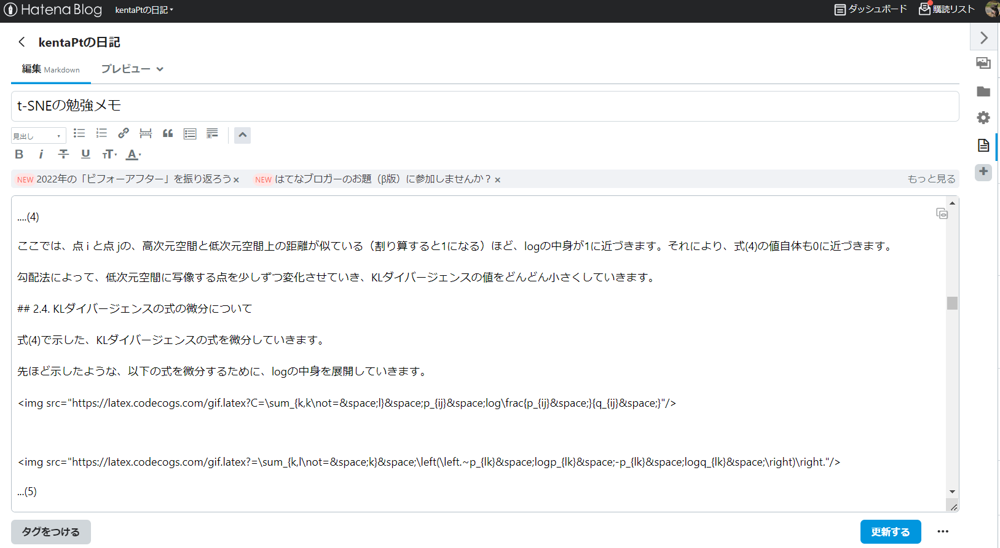

`プレビュー`モードにすると数式もうまく変換されていることがわかります。画像などを貼り付けて、その他の設定が完了すれば、投稿準備完了です。

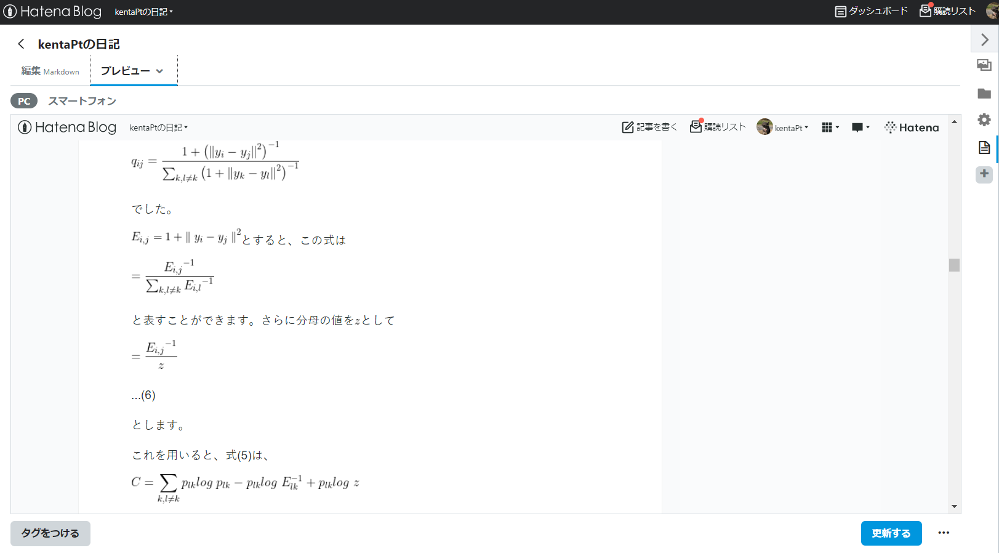

# 今回の方法で嬉しいこと

この章では、今回の方法でブログ記事を書いた場合に嬉しいことを述べます。あくまで個人的な意見です。また、ほかにもよりよい方法があるかもしれません。

**1 初めからマークダウンで書くよりも、簡単にかける**

マークダウンで書く場合は、太字にする場合や、下線を引く場合、画像を添付する場合に、それぞれの書き方があります。例えば、太字にしたい場合は、**太字**とし、画像を挿入したい場合は、

``

などとします。

個人的には、ひとつひとつこのように書いていくのは少し時間がかかってしまいます。一方、MATLABのlive scriptでは、画像は、Ctrl + V 貼り付けができ、非常に簡単です。

`このような色付け`も、Ctrl + M で簡単にできます。

さらに、MATLABのlive scriptでは、Wordと同様に、太字は、Ctrl + B、斜体はCtrl + IのようにWordと同じ方法で文字の調整ができます。

**2 コードを書く＆実行する、と同時にブログ執筆ができる**

技術関連のブログ投稿は、プログラミングコードも一緒に記述する場合が多いと思います。

私が普段行っているブログ投稿のように、技術的なことを説明しつつも、時折、コードを実行しながら理解を深める場合は、live scriptが非常に便利です。そして、ここで紹介した方法では、図（figure; plot(x, y))も一緒にエキスポートすることができます。

**3 Github（Git）と連携しながら執筆できる**

2と関連して、コードを書きながら記事の執筆を進める場合、間違いや、コードの修正は避けられません。一度書いたコードや原稿を、修正したあとに、「やっぱりこれがよかったな」ということはありうると思います。そのようなバックアップ用などにGit連携の機能は有用です。また、他のPCで執筆を継続する場合でも、git pullをすると、最新の状態から執筆を継続できます。

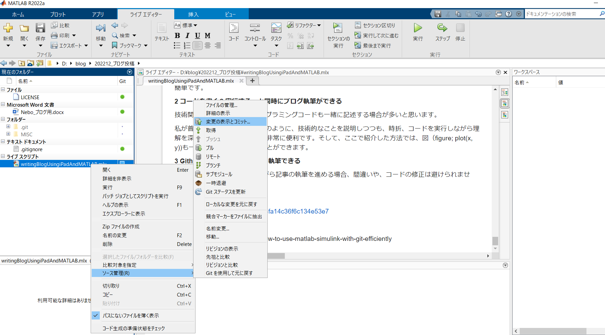

MATLAB上での操作も簡単です。

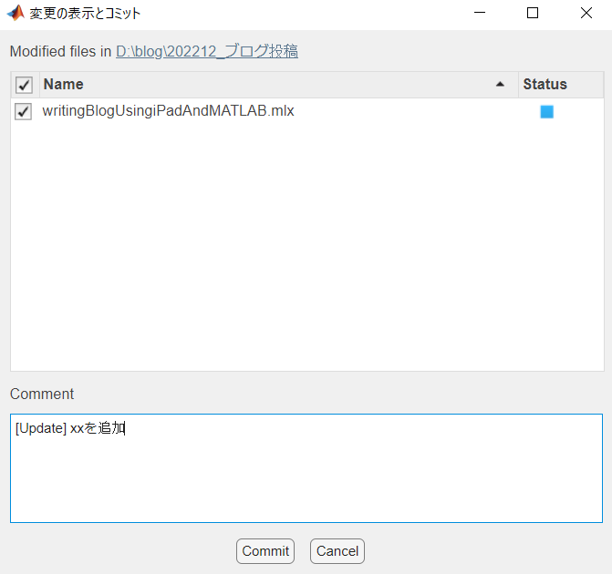

git連携については以下のページがわかりやすそうでした。

ただ、私の場合は、他の言語などを使う場合に、git bashを利用しており、

MATLABの場合も、リポジトリを作成した直後の作業では、git bashを併用しています。

[https://qiita.com/stozaki/items/e4fa14c36f6c134e53e7](https://qiita.com/stozaki/items/e4fa14c36f6c134e53e7)

[https://github.com/mathworks/how-to-use-matlab-simulink-with-git-efficiently](https://github.com/mathworks/how-to-use-matlab-simulink-with-git-efficiently)

# まとめ

本記事では、iPadで数式を書いて、Wordでエキスポートし、MATLABのlivescriptでブログ記事の準備をする方法について紹介しました。記事を書くのも大変な作業ですが、便利なツールを使い分けながら進めると楽しみながらできるのではないかと思います。ブログを投稿してみたい方がいらっしゃれば、その参考になれば幸いです。

先日の講演会でも、ブログ投稿のためのMATLAB利用についても質疑応答セッションで、無理やり紹介したかったのですが、時間（と関係ないことをぶっこむ勇気）が足りませんでした。アドベントカレンダーの記事として紹介できてよかったです。

https://note.locusblue.com/n/n66c57712b2cf
